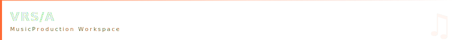
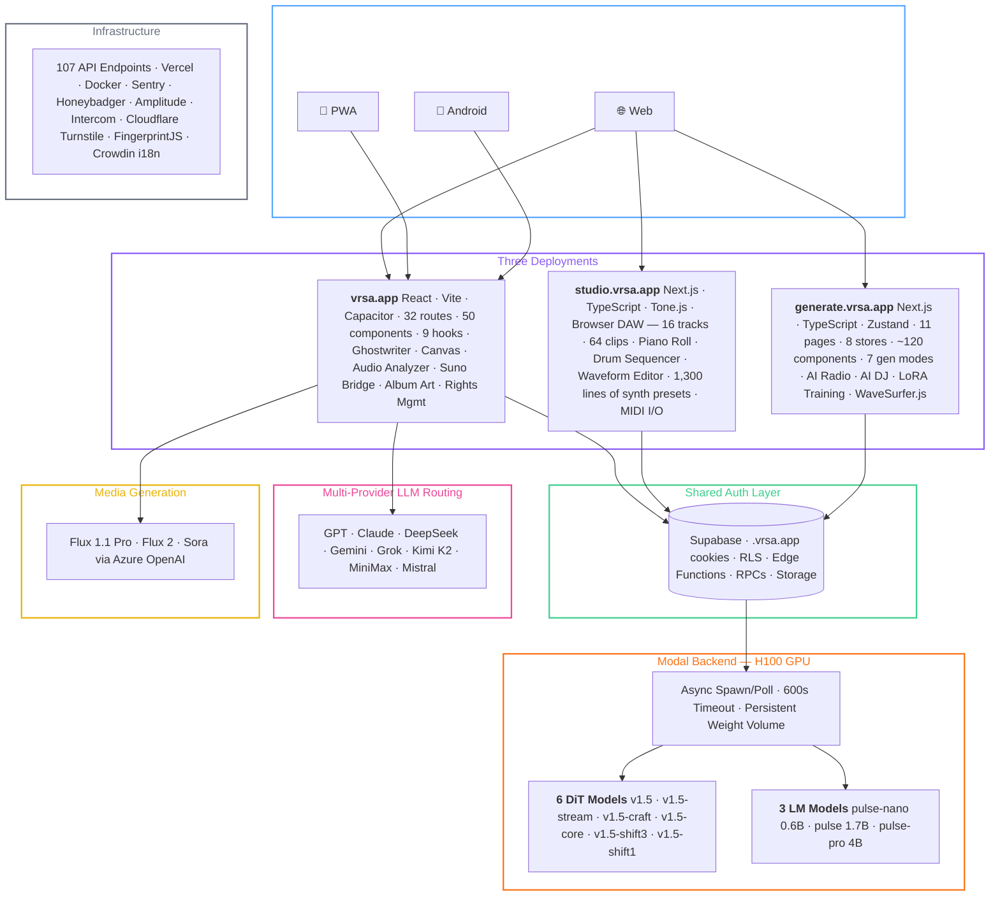
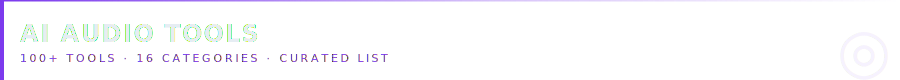
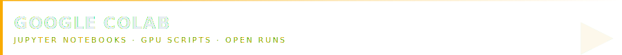
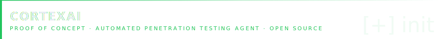
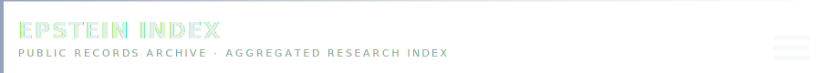
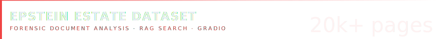
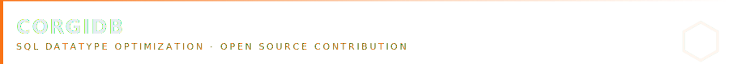
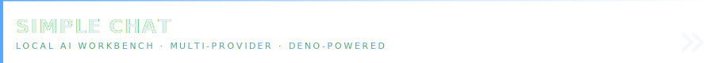

  
  
  

  
  
  

  

I spent years inside classified networks, SIPRnet, compartmented systems, environments where bad configuration isn't a learning opportunity, it's an incident. That background made me obsessive about how things actually work under the hood, and impatient with software that cuts corners on security.  
Now I channel that into building: production-grade tools I maintain myself, open-source utilities that scratch real itches, and contributions to projects I actually use. Most of what I ship lives at the intersection of AI, audio/music, and security tooling.

  

  

Bootstrapped, solo-dev AI workstation for lyric writing and music production — now a **multi-app platform spanning 3 deployments, 3 separate codebases, and 9 proprietary model variants**. Grew from a personal tool to daily active users and paying subscribers with zero advertising.
<svg xmlns="http://www.w3.org/2000/svg" viewBox="0 0 1000 24">
  <path d="M0 12h450 l5 -5 l10 14 l10 -18 l10 14 l5 -5 h450" stroke="#8B5CF6" stroke-width="1.2" fill="none" stroke-linejoin="round"/>
  <line x1="0" y1="12" x2="445" y2="12" stroke="#30363D" stroke-width="1"/>
  <line x1="555" y1="12" x2="1000" y2="12" stroke="#30363D" stroke-width="1"/>
</svg>

#### **Platform surfaces:**

| App | Stack | Status |
|---|---|---|
| [vrsa.app](https://vrsa.app) | React + Vite + Capacitor 8 | Live |
| [studio.vrsa.app](https://studio.vrsa.app) | Next.js 16 + TypeScript + Docker | Live |
| [generate.vrsa.app](https://generate.vrsa.app) | Next.js + React + Zustand + WaveSurfer.js | WIP |

Platform Architecture

  

<svg xmlns="http://www.w3.org/2000/svg" viewBox="0 0 1000 20">
  <path d="M435 10h15 M460 10h5 M475 10h25 M510 10h5 M525 10h15 M550 10h5" stroke="#58A6FF" stroke-width="1.5"/>
</svg>

#### **VRSA v1.5 — AI Music Generation Engine:**
<svg xmlns="http://www.w3.org/2000/svg" viewBox="0 0 1000 24">
  <path d="M0 12h470 M530 12h470" stroke="#30363D" stroke-width="1"/>
  <path d="M480 8v8 M490 4v16 M500 10v4 M510 6v12 M520 8v8" stroke="#8b949e" stroke-width="2.5" stroke-linecap="round"/>
</svg>

Custom cloud inference backend running **6 DiT plus 3 LM model variants** on H100 GPUs, all served from a persistent weight volume with async spawn/poll architecture:

| VRSA Name | Type | Description |
|---|---|---|
| vrsa v1.5 | DiT (default) | Turbo — balanced speed + quality |
| vrsa v1.5-stream | DiT | Continuous generation mode |
| vrsa v1.5-craft | DiT | SFT — higher fidelity |
| vrsa v1.5-core | DiT | Base model |
| vrsa v1.5-shift3 / shift1 | DiT | Flow-shift variants |
| vrsa-pulse-nano | LM 0.6B | Fast token-level generation |
| vrsa-pulse | LM 1.7B | Balanced LM |
| vrsa-pulse-pro | LM 4B (default) | Full reasoning + CoT metadata |

#### **7 task types:**

| | | | | | | |
|---|---|---|---|---|---|---|
| Text to Music | Music to Music | Cover | Repainting | Extracting | Section by Section Build | Complete |

#### **Output formats:**  
mp3 · flac · wav · wav32 · opus · aac   
#### **Generation surface:**    
BPM, key/scale, time signature, guidance scale, ODE/SDE sampling, CFG interval, latent shift/rescale, batch size up to 8

#### **30+ page modules in vrsa.app:**

| Module | Description |
|---|---|
| **Ghostwriter** | Chat-based lyric generation with session memory, multi-model A/B mode, take history, and album-context awareness |
| **Canvas** | Notion-inspired editor with inline AI edits, syllable counter, rhyme heatmap, and MP3 transcription |
| **Suno Bridge** | Chrome + Firefox extensions that capture auth tokens and route lyrics directly to the Suno with version picker (v4 → v5) |
| **Audio Analyzer** | BPM + key/scale detection via custom VM audio engine running Essentia.js WASM |
| **Album Art** | Flux 1.1 Pro, Flux 2, and Sora via Azure OpenAI deployments |
| **Multi-model routing** | GPT, Claude, DeepSeek, Gemini, Grok, Kimi K2, MiniMax, Mistral across OpenAI, Bedrock, OpenRouter, and Google APIs |
| **Rights Management** | Proof-of-creation PDF certificate generator |
| **MyMusic / Projects / AlbumWorkspace** | Full library, project, and album management |
| **Admin Panel** | Platform administration, really just a view only style cms for me to see stats |
| **Studio Pass** | Subscription and billing management |
| **Mobile** | Capacitor 8 Android build + full PWA support |

#### **Infrastructure:**

| | |
|---|---|
| **Auth** | Cross-subdomain cookies scoped to `.vrsa.app`, shared across all three apps |
| **Compute** | Modal async generation pipeline, H100 GPU, 600s timeout, persistent weights volume |
| **API** | 107 endpoints mapped and routed |
| **DevOps** | Crowdin i18n workflow, Docker + docker-compose, multi-project deployment |

> App: **[vrsa.app](https://vrsa.app)** · Studio: **[studio.vrsa.app](https://studio.vrsa.app)** · Generate *(WIP)*: **[generate.vrsa.app](https://generate.vrsa.app)**

 

<svg xmlns="http://www.w3.org/2000/svg" viewBox="0 0 1000 24">
  <path d="M0 12h470 M530 12h470" stroke="#30363D" stroke-width="1"/>
  <path d="M480 8v8 M490 4v16 M500 10v4 M510 6v12 M520 8v8" stroke="#8b949e" stroke-width="2.5" stroke-linecap="round"/>
</svg>

 

  

#### A curated list of 100+ AI-powered audio tools across 16 categories:  
music creation, voice cloning, stem separation, TTS, transcription, sound detection, and more. 

  

 

    

 

**[HeartLib Script](https://github.com/theelderemo/HeartLib-Google-Colab)**

Optimized scripts for running [HeartMuLa](https://github.com/HeartMuLa/heartlib) music generation with maximum performance on NVIDIA GPUs, especially A100.

<svg xmlns="http://www.w3.org/2000/svg" viewBox="0 0 1000 20">
  <path d="M0 10h475 M525 10h475" stroke="#30363D" stroke-width="1"/>
  <path d="M485 5v10h5 M515 5v10h-5" stroke="#58A6FF" stroke-width="1.5" fill="none"/>
  <rect x="495" y="8" width="10" height="4" fill="#6B7280"/>
</svg>

**[Ollama Stack](https://github.com/theelderemo/ollama-google-colab)**

Full Ollama stack running on Google Colab with Gradio as a UI — spin up a local LLM in your browser with zero local setup.

<svg xmlns="http://www.w3.org/2000/svg" viewBox="0 0 1000 20">
  <path d="M0 10h475 M525 10h475" stroke="#30363D" stroke-width="1"/>
  <path d="M485 5v10h5 M515 5v10h-5" stroke="#58A6FF" stroke-width="1.5" fill="none"/>
  <rect x="495" y="8" width="10" height="4" fill="#6B7280"/>
</svg>

**[Wan 2.2 Video](https://github.com/theelderemo/wan2.2-google-colab)**

 

Plug-and-play Colab notebook for Wan 2.2 — an advanced image-to-video model — stripped down to just work.

 

  

This was a proof of concept project for myself. Open-source AI-powered penetration testing agent that automates reconnaissance, vulnerability discovery, and analysis. Executes authorized security tests using installed tools, maintains immutable audit trails, and delivers findings with OWASP mapping and remediation guidance. Fair warning, it's a monorepo.

 

  

A comprehensive, unified research archive aggregating public releases related to the Jeffrey Epstein estate and associated investigations. 

 

  

When the U.S. House Oversight Committee released 20,000+ pages of unstructured documents, the data was technically public but practically inaccessible. I built a forensic analysis tool to change that.

<dl>
  <dt>Search Engine:</dt>
  <dd>— Local RAG-ready search interface via Gradio for rapid keyword and passage analysis across the full corpus.</dd>
  <dt>Governance:</dt>
  <dd>— Established a Responsible Use Framework to prevent misuse while keeping the tool genuinely open for researchers and journalists.</dd>
</dl>

 

  

The original `eDEX-UI` — a well-known sci-fi terminal emulator — was archived with an unresolved security vulnerability. I forked it, patched the flaw, modernized the codebase, removed all deprecated dependencies, and cut a clean release. 

> All legacy code has been replaced, minor additional vulns remediated, and the dependency tree is fully up to date.

 

  

Contributed a helper function to automate efficient SQL datatype selection for pandas DataFrames — reducing manual overhead and ensuring optimal storage across schema generation workflows.

 

  

Local AI chat workbench with multi-provider support (AWS Bedrock, OpenAI, Azure, Gemini) - Deno-powered server with browser-based UI  

 

Certifications

  

 

<!--START_SECTION:badges-->

<!--END_SECTION:badges-->

 

  

 

<svg xmlns="http://www.w3.org/2000/svg" viewBox="0 0 1000 24">
  <path d="M0 12h480 M520 12h480" stroke="#30363D" stroke-width="1"/>
  <path d="M488 8l5 4-5 4 M498 16h8" stroke="#58A6FF" stroke-width="1.5" fill="none" stroke-linecap="round" stroke-linejoin="round"/>
</svg>

  

<!-- 
  49 66 20 79 6f 75 27 72 65 20 72 65 61 64 69 6e 67 20 74 68 69 73 2c 
  79 6f 75 20 61 6c 72 65 61 64 79 20 6b 6e 6f 77 20 77 68 61 74 20 69 74 20 73 61 79 73 2e
-->
